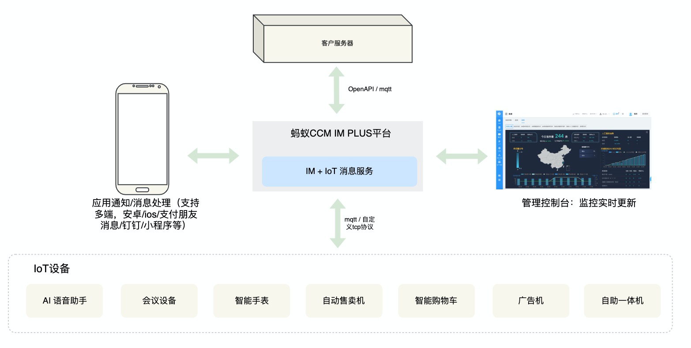

**English** | [中文](README_CN.md)
#  Jmqtt

## Features
* Full support of mqtt3.1.1 protocol
* Support data persistence and clustering based on MySQL
* Support friendly secondary development, plug-in development: cluster / storage / device connection, publish subscribe authentication
* Support tcp, websocket, SSL, WSS

## Official documents
[Official documents](https://arrogant95.github.io/jmqtt-docs/)

## Quick start
1. Download [release](https://github.com/Cicizz/jmqtt/releases) (Version above 3. X) Or `clone` this project
2. Execute in the broker directory:`mvn -Ppackage-all -DskipTests clean install -U`
3. Configuration file for configuration response:`/jmqtt-broker/resources/conf`
4. Execute the start command:`java -jar jmqtt-broker-3.0.0.jar -h ${conf文件目录}` -H is followed by the configuration file directory, which needs to contain jmqtt.properties And log4j2. XML

## Online trial
Server address: 81.69.46.38
TCP port: 1883
Websocket port: 8883
SSL port: 1884
WSS port: 8884

## QQ technology exchange group

## test report
jmqtt-doc/docs/TEST_REPORT.md

## 基于蚂蚁技术底座的IoT消息服务
1. 提供iot端完整消息服务，接入设备管理&监控等
2. 结合蚂蚁智能能力(对话机器人，智能助理，实时音视频)等，提供端智能终端解决方案，提供IM+IoT消息解决方案
3. 完全免费，欢迎使用。感兴趣的同学欢迎联系我：钉钉号：zhanze2013 或 qq私聊我（jmqtt群群主）

